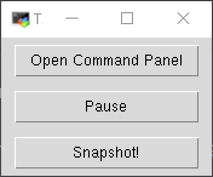
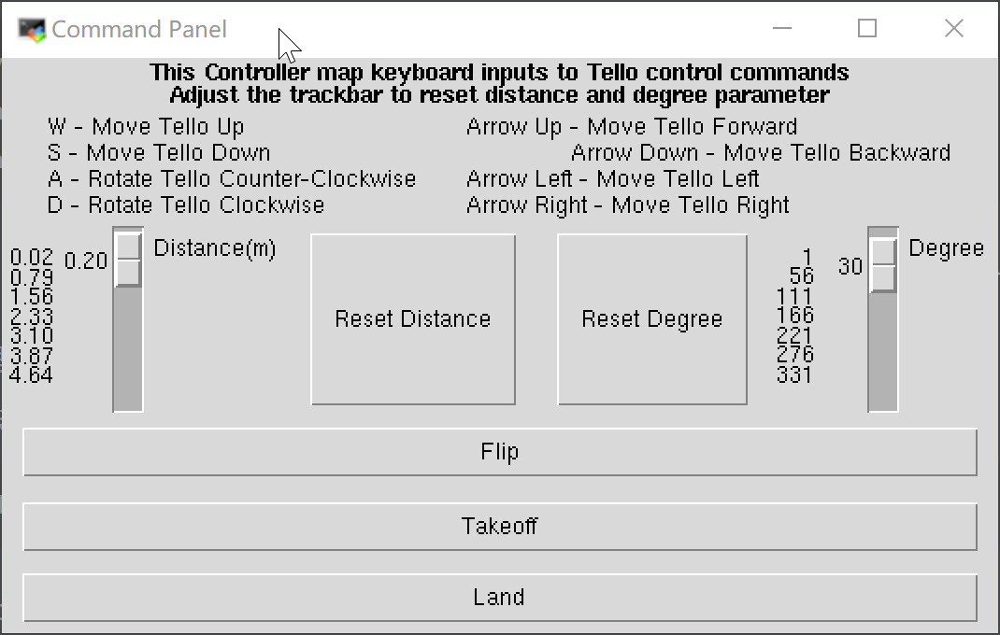

# Tello_Video

这是用GUI界面获取tello图像的代码，主要用于相机标定课件。

改版自官方SDK:https://github.com/dji-sdk/Tello-Python

## 1.安装

```
sudo apt-get install libboost-all-dev libavcodec-dev libswscale-dev
# 如果已经存在就不需要创建新环境，注意是2.7
conda create -n tello python=2.7
conda activate tello

pip install pyyaml numpy matplotlib opencv-python Pillow

cd ~/catkin_ws/src/

git clone https://github.com/zoeyuchao/tello_video.git

cd tello_video/h264decoder
mkdir build && cd build
cmake .. && make
cp libh264decoder.so ../../
```

## 2.使用

连接上tello的wifi，然后打开一个终端输入：

```
conda activate tello
cd ~/catkin_ws/src/tello_video
python main.py
```



- 在GUI界面里点击snapshot可以保存照片，用于相机标定。

  - 将照片保存在calib文件夹下，该文件夹下有calibration.py文件用于标定，标定方法是：

    ```
    python calibration.py
    ```

- 点击“open command panel”，可以打开控制面板：

  

  - Take Off
  - Land
  - Flip (in forward, backward, left and right direction)
  - Control Tello using keyboard inputs:
      - **[key-Up]** move forward 20cm
      - **[key-Down]** move backward 20cm
      - **[key-Left]** move left 20 cm
      - **[key-Right]** move right 20 cm
      - **[key-w]** move up 20cm
      - **[key-s]** move down 20cm
      - **[key-a]** rotate counter-clockwise by 30 degree
      - **[key-d]** rotate clockwise by 30 degree

- You can also adjust the **distance** and **degree** via the trackbar and hit the "reset distance" or "reset degree" button to customize your own control.

## 3.Tips

### -  tello.py - class Tello

Wrapper class to interact with Tello drone.
Modified from <https://github.com/microlinux/tello>

The object starts 2 threads:

 1. thread for receiving command response from Tello
 2. thread for receiving video stream

You can use **read()** to read the last frame from Tello camera, and pause the video by setting **video_freeze(is_freeze=True)**.

### - tello_control_ui.py - class TelloUI

Modified from: https://www.pyimagesearch.com/2016/05/30/displaying-a-video-feed-with-opencv-and-tkinter/

Build with Tkinter. Display video, control video play/pause and control Tello using buttons and arrow keys.

### - h264decoder - class libh264decoder

From <https://github.com/DaWelter/h264decoder>.

A c++ based class that decodes raw h264 data. This module interacts with python language via python-libboost library, and its decoding functionality is based on ffmpeg library. 

After compilation, a libh264decoder.so or libh264decoder.pyd file will be placed in the working directory so that the main python file can reference it. 

## 4.其他系统

- 如果是windows的同学：

	进入 "install\Windows" 文件夹，运行 "install.bat" 。

- 如果是Mac的同学：

1. Make sure you have the latest Xcode command line tools installed. If not, you might need to update your OS X and XCode to the latest version in order to compile the h264 decoder module
2. Go to the "install\Mac" folder folder in command line, run

```
   cd tello_video\install\Mac
   chmod a+x ./mac_install.sh
   ./mac_install.sh
```